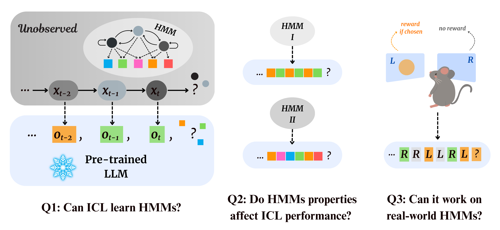
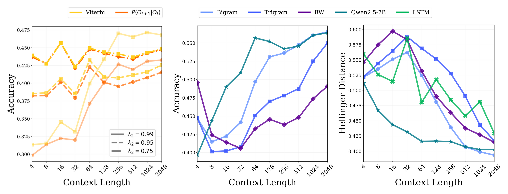
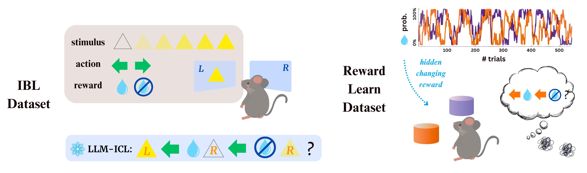

# Pre-trained Large Language Models Learn *Hidden* Markov Models In-context

This is the official implementation of the experiments in the paper [Pre-trained Large Language Models Learn *Hidden* Markov Models In-context](). This repository contains both synthetic experiments with Hidden Markov Models (HMMs) and real-world experiments on animal behavioral datasets, including the [IBL behavior dataset](https://int-brain-lab.github.io/iblenv/notebooks_external/data_release_behavior.html) and the [reward learning dataset](https://figshare.com/articles/dataset/From_predictive_models_to_cognitive_models_Separable_behavioral_processes_underlying_reward_learning_in_the_rat/20449356).



## Installation

Clone this repository and run:
```sh
pip install -r requirements.txt
```
You must have Python `>=3.10` installed.

---

## Synthetic Experiments

This section contains code to generate and evaluate sequences based on varying properties of HMMs. We include evaluations of in-context learning of LLMs, Baum-Welch, LSTMs, N-grams, the Viterbi algorithm, and $P(O_{t+1}|O_{t-k:t})$.



See the [synthetic/README.md](synthetic/README.md) for a step-by-step guide to running the code and obtaining results.

---

## Real-World Experiments

This section contains code to process and evaluate real-world animal behavioral datasets, including the International Brain Laboratory (IBL) behavior dataset and reward learning datasets. All steps of the IBL data processing follow the methodology of the [GLM-HMM paper](https://github.com/zashwood/glm-hmm).



See the [real_world/README.md](real_world/README.md) for a step-by-step guide to running the code and obtaining results.

---

## Folder Structure

```
icl_hmm/
├── real_world/
│   ├── load_ibl_data.py
│   ├── load_rew_learn_data.py
│   ├── evaluate.py
│   └── README.md
├── synthetic/
│   ├── hmm.py
│   ├── construct_A_matrix.py
│   ├── generate_dataset.py
│   ├── evaluate.py
│   └── README.md
├── figures/
│   ├── summary.png
│   ├── syn_results.png
│   ├── real_world_cartoon.png
│   └── real_world_results.png
├── requirements.txt
├── LICENSE
└── README.md
```

---

## Citation

<!-- Please add your citation here when available. -->
```
[To be added]
```
