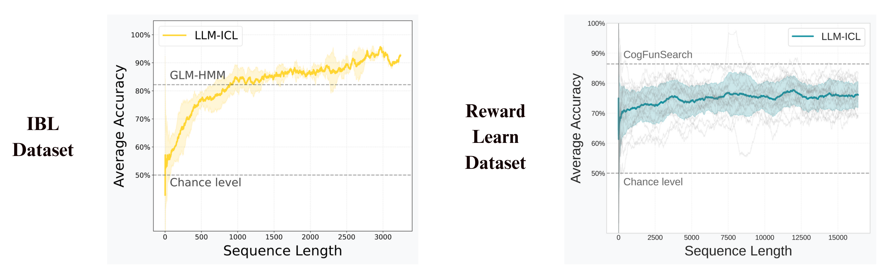

## Real-World Experiments: Step-by-Step Usage

This directory contains code to process and evaluate real-world animal behavioral datasets, including the International Brain Laboratory (IBL) behavior dataset and reward learning datasets. All steps of the IBL data processing follow the methodology of the [GLM-HMM paper](https://github.com/zashwood/glm-hmm).


---

### 1. IBL Data Preparation

Download, extract, and preprocess behavioral data from the International Brain Laboratory (IBL):

```sh
python real_world/load_ibl_data.py
```

- Downloads and extracts IBL data if not already present.
- Processes sessions, filters animals with sufficient data, and outputs JSON files with session and animal data.
- **Output:** JSON files in `ibl_data/` (e.g., `ibl_data_by_animal_dict.json`)

---

### 2. Reward Learning Data Preparation

Download and preprocess reward learning datasets for evaluation:

```sh
python real_world/load_rew_learn_data.py
```

- Downloads and prepares reward learning datasets for further analysis.

---

### 3. Evaluation with LLMs and Baselines

Evaluate LLMs and other baselines on the real-world IBL and reward learning datasets.



```sh
python real_world/evaluate.py
```

- Loads preprocessed IBL and reward learning data.
- Evaluates various models and baselines.
- **Output:** Results stored in the `real_world/results/` directory.

---

### Notes

- All scripts should be run from the `real_world/` directory.
- For more details on each method, see the code comments in the respective scripts.
