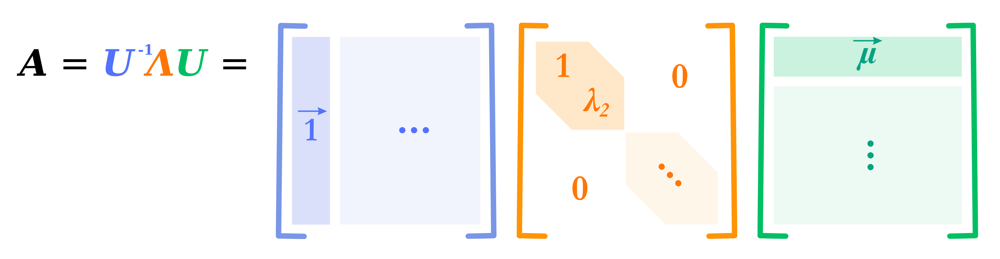

## Synthetic Experiments: Step-by-Step Usage

This directory contains code to generate and evaluate sequences based on Hidden Markov Models (HMMs) with varying properties. We provide tools to evaluate in-context learning of LLMs, Baum-Welch, LSTMs, N-grams, Viterbi, and $P(O_{t+1}|O_{t-k:t})$.

---

### 1. Construct Transition Matrices

Generate transition matrices with varying entropies, mixing rates, and steady-state distributions.



```sh
python synthetic/construct_A_matrix.py
```

- **Output:** `synthetic/data/A_matrix.pickle`

---

### 2. Generate Synthetic Datasets

Generate sequences of hidden states and emissions using the transition matrices.

```sh
python synthetic/generate_dataset.py
```

- **Output:** `synthetic/data/generations.pickle`

---

### 3. Evaluate with LLMs and Baselines

Evaluate Baum-Welch, Viterbi, N-gram, $P(O_{t+1}|O_{t-k:t})$, LSTM, and LLMs on the generated data.


```sh
python synthetic/evaluate.py
```

- **Output:**  
  - All 4096 results for BW, LSTM, LLMs in `syn_results.pickle`  
  - Averaged results for all methods in `syn_results.csv`

---

### Notes

- All scripts should be run from the `synthetic/` directory.
- For more details on each method, see the code comments in the respective scripts.